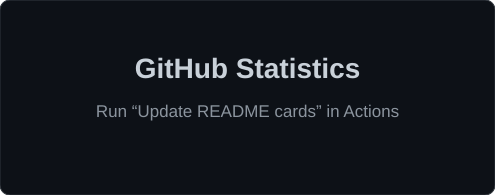
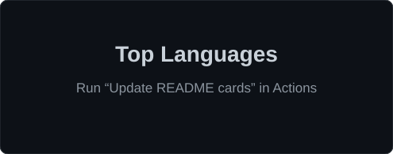

<!-- ============================================================
     GitHub Profile README — Pasan Jayaweera

     Repository: pasanjayaweerabis-cloud/pasanjayaweerabis-cloud

     Required local assets:
       /assets/linkedin.svg
       /assets/github.svg
       /assets/gmail.svg

     GitHub statistics are generated into /profile by the workflow:
       /.github/workflows/readme-cards.yml
     ============================================================ -->

<h1 align="center">Pasan Jayaweera</h1>

  <b>BEng (Hons) Software Engineering Student</b>
   
  Aspiring <b>Cloud Security Engineer</b>
    
  Linux · Cloud · Infrastructure as Code · DevSecOps

  
  &nbsp;&nbsp;&nbsp;&nbsp;
  
  &nbsp;&nbsp;&nbsp;&nbsp;
  

---

## About Me

I'm a **Software Engineering undergraduate at the Informatics Institute of Technology (IIT), Sri Lanka**, affiliated with the **University of Westminster**.

My current technical focus is **cloud infrastructure and security**, while continuing to strengthen my software engineering foundations.

I enjoy working with systems that are:

- **Secure**
- **Reliable**
- **Automated**
- **Scalable**
- **Maintainable**

---

## Current Status

| Area | Current Status |
|---|---|
| 🎓 **Education** | BEng (Hons) Software Engineering — IIT Sri Lanka |
| 💻 **Primary Field** | Software Engineering |
| ☁️ **Technical Focus** | Cloud Computing & Cloud Security |
| 🐧 **Currently Learning** | Linux & Operating Systems |
| 🌐 **Developing Skills** | Networking, TCP/IP & Cloud Infrastructure |
| 🏗️ **Infrastructure** | Terraform & Infrastructure as Code |
| ⚙️ **DevOps** | Git, GitHub Actions & CI/CD |
| 📦 **Containers** | Docker & Kubernetes |
| 🔐 **Security Interests** | IAM, Cloud Security & Infrastructure Security |

---

# Tech Stack

<table>
<tr>

<td align="center" width="25%" valign="top">

### Core Engineering

&nbsp;

&nbsp;

  

&nbsp;

</td>

<td align="center" width="25%" valign="top">

### Cloud & Infrastructure

&nbsp;

&nbsp;

  

&nbsp;

&nbsp;

</td>

<td align="center" width="25%" valign="top">

### DevOps & Security

&nbsp;

&nbsp;

  

🔐 <b>IAM</b>
 
🛡️ <b>Cloud Security</b>
 
⚙️ <b>Secure CI/CD</b>

</td>

<td align="center" width="25%" valign="top">

### Development

&nbsp;

&nbsp;

  

<b>REST APIs</b>
 
<b>Backend Development</b>
 
<b>Web Applications</b>

</td>

</tr>
</table>

---

# GitHub Statistics

<table>
<tr>
<td align="center" width="50%">

</td>
<td align="center" width="50%">

</td>
</tr>
</table>

  

---

# GitHub Activity

  

---

# Connect With Me

  
  &nbsp;&nbsp;&nbsp;&nbsp;
  
  &nbsp;&nbsp;&nbsp;&nbsp;
  

---

  <i>Building software today. Securing the cloud tomorrow.</i>

